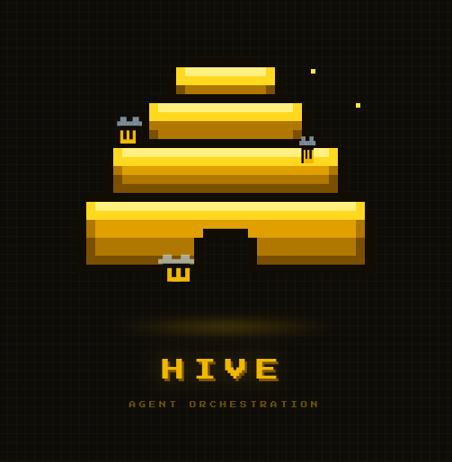

# Hive

  

Hive is a desktop app for working with CLI coding agents without living inside a
pile of terminal tabs.

It gives tools like Codex, Claude Code, and Aider a small, structured chat UI:
sessions on the left, messages in the middle, diffs on the right, and worktree
context close at hand. Under the hood, each agent still runs as its normal CLI
process in a PTY. Hive just gives that process a nicer place to live.

The aim is simple: keep the speed and directness of terminal-based agents, but
make it easier to run a few threads of work side by side.

## Status

Hive is early and actively under construction. The app builds and opens, but the
agent orchestration workflow is still being wired in.

## Planned Features

- Structured chat UI for CLI agents instead of raw embedded terminals
- Long-lived PTY agent processes with streamed markdown output
- Per-session history, status, working directory, and selected model
- Git worktree selection and management
- Session-scoped diff panel for changes since the baseline commit
- Keyboard-first navigation and command palette
- Linux-native GPUI frontend with a lightweight pixel-hive visual style

## License

Apache-2.0
